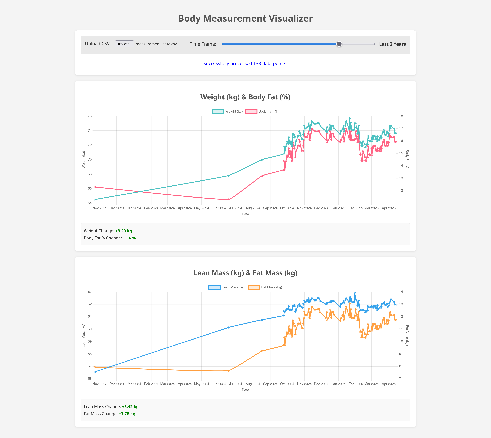

* Hevy Body Measurement Visualizer

This is a single-page web application designed to visualize body
weight and body fat percentage data exported from the *Hevy*
application. It allows you to upload your CSV export and view trends
over different time periods.

The application calculates and displays:
- Weight (kg) over time
- Body Fat (%) over time
- Calculated Lean Body Mass (kg) over time
- Calculated Fat Mass (kg) over time

It also provides absolute changes in these metrics for the selected time frame.

* Screenshot

* CSV Data Specification (Hevy Export)

The application expects a CSV file with the following characteristics, matching the format typically exported by Hevy for body measurements:

1.  *Header Row*: The first row must contain column headers.
2.  *Required Columns*:
    - =date=: The timestamp of the measurement.
      - *Format*: Must be parseable as "DD MMM YYYY, HH:mm" (e.g., "23 Oct 2023, 00:00").
    - =weight_kg=: Body weight in kilograms.
      - *Format*: Numeric value (e.g., 70.5).
    - =fat_percent=: Body fat percentage.
      - *Format*: Numeric value (e.g., 13.2).
3.  *Optional Columns*: Any other columns present in the file (like `neck_cm`, `chest_cm`, etc.) are ignored by this application.
4.  *Empty Values*: Rows where `date`, `weight_kg`, or `fat_percent` are missing or cannot be correctly parsed will be skipped.
5.  *Delimiter*: Standard comma (,) delimiter.
6.  *Encoding*: UTF-8 is recommended.

*Example CSV Snippet:*
#+BEGIN_SRC csv
"date","weight_kg","fat_percent","neck_cm","shoulder_cm","chest_cm",...
"23 Oct 2023, 00:00",64.5,12.3,,,,,,...
"18 Jun 2024, 00:00",67.8,11.3,,,,,,...
"17 Aug 2024, 00:00",70,13.2,,,,,,...
#+END_SRC

* Calculations

- *Lean Body Mass (kg)* = `weight_kg` * (1 - (`fat_percent` / 100))
- *Fat Mass (kg)* = `weight_kg` * (`fat_percent` / 100)
- *Absolute Change* = Value at the end date of the selected period - Value at the start date of the selected period.

* Dependencies

This application runs entirely in the browser and relies on the following external JavaScript libraries loaded via CDN:

- *PapaParse*: For robust CSV parsing.
- *Moment.js*: For date/time manipulation and filtering.
- *Chart.js*: For rendering interactive charts.
- *chartjs-adapter-moment*: To integrate Moment.js with Chart.js time scales.
